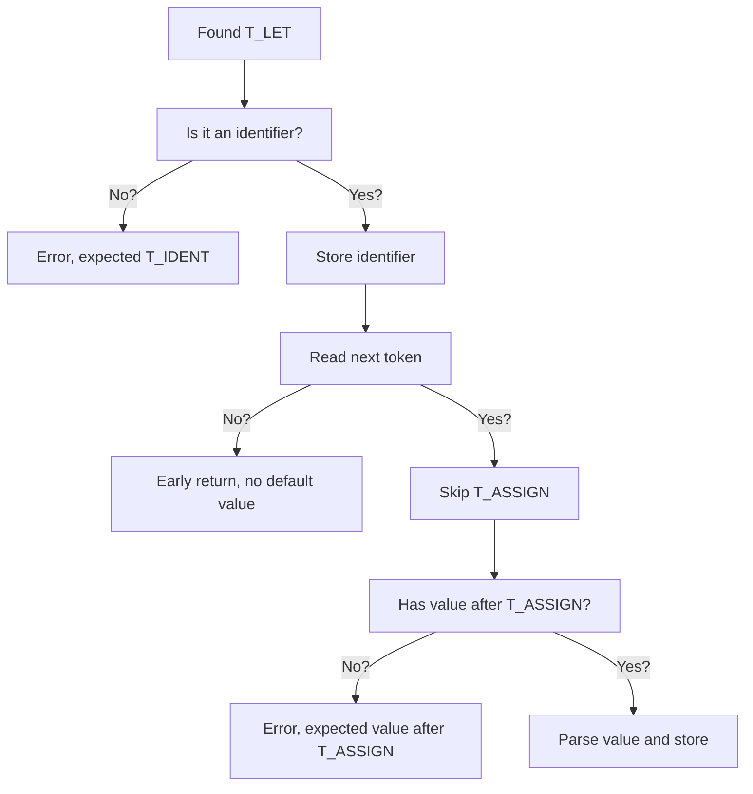

# What is a parser?

If you did a computer science course at university, chances are you've spent a decent amount of time learning about parsers. If that's you, feel free to skip over this chapter.

If you _don't_ know what a parser is, keep on reading. I'll do my best to explain things simply.

## Tokens

Essentially every programming language begins by breaking your code down into tokens.

Let's assume we have a JavaScript-like language.

```js
let name = "Ryan";
```

We naturally give each word and character in the code a name. We'd call `let` a **keyword**, `name` would be an **identifier** and `"Ryan"` would be a **string**.

The names we assign to each word and character are known as of token types.

```php
T_LET       "let"
T_IDENT     "name"
T_ASSIGN    "="
T_STRING    "Ryan"
```

Keywords tend to have more specific names than `T_KEYWORD`. This becomes useful when we start processing our stream of tokens.

## Parsing

Once the code has been broken down into a list of tokens, we can start processing and analysing the tokens. 

A parser will look at each token in our source and generate a formal data structure to represent the logical structure and flow of our program.

The simplest of parsers will look at the current token and make some assertions on the next token in the list. Using the code example from above, we can use the flowchart below to demonstrate our logic.



This is a high-level description of how a parser, well, parses. After each token, it checks a couple of conditions and determines what the next move is.

At any point in time, the parser could find a problem. This is when you'll come across _"Parse error"_ or similar in your favourite programming languages.

Once the parser has analysed all of the tokens, it will return a tree structure that represents the logical flow of your program. This is called an **Abstract Syntax-Tree** (AST).

At the top-level, an AST is a list of top-level **nodes**. Each nodes is a different piece of logic in the program.

A node can also store other nodes. This is more common when looking at conditional logic, such as the code that executes when an `if` statement's condition evaluates to `true`. 

If we were to represent our `let` statement as a node, using JSON, it would probably look like this:

```json
{
    "type": "LetStatement",
    "ident": "name",
    "value": {
        "type": "StringLiteral",
        "value": "Ryan",
    },
    "line": 1
}
```

Our `LetStatement` node stores an `ident` and `value`, both of which were retrieved by the parser in the flowchart above. What's special about the `value` key is that it stores another node. Our code set the value of the `name` variable to `Ryan` which is a `StringLiteral`.

### Parser generators

If you've done any amount of research into programming language design and development, you've likely come across this term before.

Parser generators are specialised tools that normally provide their own domain-specific language for writing a parser. You use a specialised grammar to define the tokens and structures in your code and the parser generator will generate a parser for you in your host language, i.e. Rust.

We'll actually be using a parser generator ([LALRPOP](https://github.com/lalrpop/lalrpop)) in this book to get started with our tree-walk interpreter. Once we have a good amount of test coverage, we'll come back and replace it with a custom parser.

Parser generators can save you a lot of time when developing a programming language - there are plenty of hugely popular languages that still use them to this day. The argument between using one of these generator tools or writing your parser is controversial, like most things in programming. I would generally recommend starting with a parser generator and moving to a hand-written one when the potential performance benefits and control are truly beneficial.